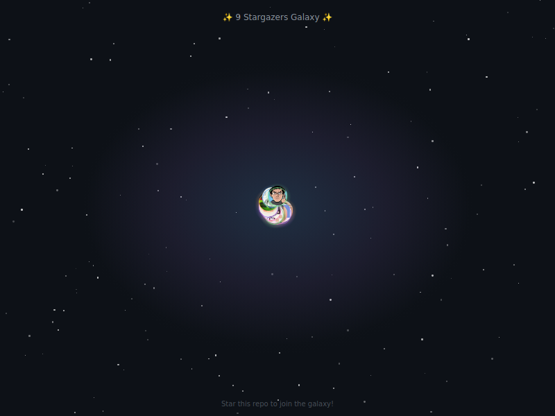
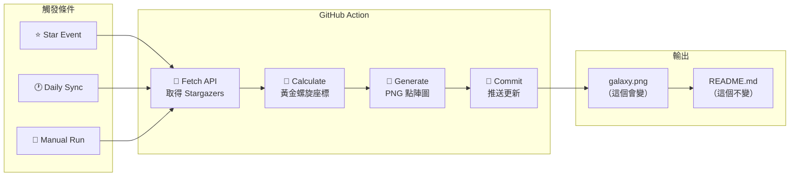

# Stargazer Galaxy 星光共同體

[](https://opensource.org/licenses/MIT)
[](https://github.com/features/actions)
[](https://nodejs.org/)

[← 回到 Muripo HQ](https://tznthou.github.io/muripo-hq/) | [English](README_EN.md)

把每一個按下 Star 的支持者，變成你專案銀河中的一顆恆星。



> ⭐ **Star 這個 Repo，你就會出現在銀河裡！**

---

## 功能特色

- **自動化星圖繪製**：GitHub Action 監聽 Star 事件，無需人工介入
- **黃金螺旋排列**：採用費波那契螺旋演算法，混亂中帶有神聖的秩序
- **永久印記**：使用者位置由 GitHub ID 決定，座標永遠屬於他
- **自我修復**：每日 UTC 00:00 自動同步，確保與實際 Star 一致
- **混合光暈**：頭像 + 彩色光暈，5 種顏色隨機分配

---

## 與其他工具比較

市面上有許多 Stargazers 視覺化工具，以下是功能比較：

| 特點 | **Stargazer Galaxy** | [Repository Roster](https://github.com/varunsridharan/action-repository-roster) | [Repo Roster](https://reporoster.com/) | [Star History](https://star-history.com/) |
|------|:--------------------:|:-----------------:|:-----------:|:------------:|
| **視覺風格** | 🌌 黃金螺旋銀河 | 📋 表格/列表 | 🔲 網格卡片 | 📈 折線圖 |
| **顯示內容** | 頭像 + 彩色光暈 | 頭像 ± 名稱 | 頭像網格 | 數量統計 |
| **輸出格式** | PNG | HTML/MD | SVG | SVG |
| **更新方式** | Action commit | Action 改 README | 即時 API | 即時 API |
| **自託管** | ✅ | ✅ | ❌ | ❌ |
| **客製化程度** | 高（改 JS） | 中（參數） | 低 | 低 |
| **排列演算法** | 費波那契螺旋 | 順序排列 | 網格排列 | 時間序列 |

### 我們的獨特之處

- **黃金螺旋排列**：採用 137.508° 黃金角，不是無聊的網格或列表
- **Seeded Random**：同一個人永遠在同一位置，座標由 username 決定
- **藝術導向**：彩色光暈 + 銀河背景，追求視覺美感而非單純功能
- **完全自託管**：不依賴第三方服務，資料留在自己的 repo 裡

---

## 這到底怎麼運作的？

> **常見誤解**：「README.md 會自動產生圖片」
> **正確理解**：README.md 本身不會變，變的是它引用的 `galaxy.svg`

### 完整流程圖

```
你 Star 這個 Repo
       ↓
GitHub 偵測到 watch event
       ↓
自動觸發 GitHub Action
       ↓
Action 執行 generate-galaxy.js
       ↓
腳本呼叫 GitHub API 取得所有 Stargazers
       ↓
用黃金螺旋算法計算每人的座標
       ↓
生成新的 assets/galaxy.svg
       ↓
Action 自動 commit + push
       ↓
README 引用的圖片「看起來」更新了
```

### 關鍵：README 不變，PNG 變

README.md 裡永遠只有這一行：

```markdown

```

這行程式碼從頭到尾都不會改變。但因為 `assets/galaxy.png` 這個檔案被 Action 更新了，所以當你重新整理頁面時，圖片內容就變了。

**就像一個相框**：相框（README）不變，但裡面的照片（PNG）換了。

---

## 系統架構



---

## 演算法說明

### 黃金螺旋 (Fibonacci Spiral)

採用自然界最美的排列方式 — 黃金角（約 137.508°）：

```
radius = scale × √n
angle = n × 137.508°
```

這種排列常見於：
- 向日葵種子
- 松果鱗片
- 銀河系旋臂

### Seeded Random

每位使用者的微小偏移由其 username 決定：

```javascript
const rand = seededRandom(username);
const offset = (rand() - 0.5) * 10;
```

確保同一個人永遠在同一個位置，即使重新生成也不會改變。

---

## 技術棧

| 技術 | 用途 | 備註 |
|------|------|------|
| GitHub Actions | 自動化觸發 | watch + schedule + dispatch |
| Node.js 20+ | 執行環境 | ES Modules |
| GitHub API | 資料來源 | Stargazers endpoint |
| Puppeteer | PNG 渲染 | Headless Chrome 截圖 |
| HTML/CSS | 排版樣式 | Radial gradient 光暈 |

---

## 快速開始

### 本地測試

```bash
# 進入專案目錄
cd day-19-stargazer-galaxy

# 生成 demo 版本（用假資料）
npm run demo

# 開啟查看
open assets/galaxy.svg
```

### 安裝到你的 Repo

#### 步驟 1：複製檔案

將以下檔案複製到你的 Repository：

```
.github/workflows/galaxy.yml  → Action 設定檔
scripts/generate-galaxy.js    → 核心繪圖腳本
package.json                  → 依賴設定
assets/                       → 輸出目錄（空的即可）
```

#### 步驟 2：設定權限

1. 進入 **Settings** > **Actions** > **General**
2. 在 **Workflow permissions** 勾選 **Read and write permissions**
3. 點擊 Save

#### 步驟 3：首次執行

1. 進入 **Actions** 頁籤
2. 找到 **Update Stargazer Galaxy**
3. 點擊 **Run workflow**
4. 等待約 30 秒，`assets/galaxy.svg` 就會誕生

#### 步驟 4：顯示在 README

```markdown

```

---

## 專案結構

```
day-19-stargazer-galaxy/
├── .github/
│   └── workflows/
│       └── galaxy.yml          # GitHub Action 設定
├── scripts/
│   └── generate-galaxy.js      # 核心繪圖腳本
├── assets/
│   └── galaxy.png              # 生成的銀河圖
├── package.json
├── README.md                   # 說明文件（中文）
└── README_EN.md                # 說明文件（英文）
```

---

## 客製化指南

打開 `scripts/generate-galaxy.js`，修改 `CONFIG` 物件：

### 改變尺寸

```javascript
const CONFIG = {
  width: 800,      // SVG 寬度
  height: 600,     // SVG 高度
  centerX: 400,    // 中心 X
  centerY: 300,    // 中心 Y
};
```

### 改變螺旋密度

```javascript
spiralScale: 18,  // 越大越稀疏，越小越密集
```

### 改變光暈顏色

```javascript
glowColors: ['#58a6ff', '#a371f7', '#f778ba', '#7ee787', '#ffa657'],
// GitHub 風格：藍、紫、粉、綠、橙
```

想要 Cyberpunk 風？試試：

```javascript
glowColors: ['#ff00ff', '#00ffff', '#ff0080', '#80ff00', '#0080ff'],
```

### 改變星星大小

```javascript
starSize: 28,  // 頭像直徑
glowSize: 40,  // 光暈直徑
```

---

## 注意事項

### API Rate Limit

- GitHub API 有速率限制
- Action 內使用 `GITHUB_TOKEN` 自動認證（5000 req/hour）
- 超大型 Repo（10000+ stars）可能需要分批處理

### Action Minutes

- 每次 star/unstar 都會觸發 Action
- 免費帳號：2000 分鐘/月
- 已設定 `concurrency` 避免同時多個執行

### 為什麼沒有 npm cache？

GitHub Actions 的 `cache: 'npm'` 需要 `package-lock.json` 才能運作。本專案為了保持簡潔，沒有提交 lock file，因此不使用 npm cache。

如果你想啟用 cache 加速（約省 10-15 秒）：
1. 本地執行 `npm install` 生成 `package-lock.json`
2. 將 `package-lock.json` commit 到 repo
3. 在 `galaxy.yml` 加入 `cache: 'npm'`

### 防濫用

```yaml
concurrency:
  group: galaxy-update
  cancel-in-progress: true
```

如果有人 star → unstar 循環，舊的 workflow 會自動取消。

---

## 隱私說明

本專案使用 GitHub 公開 API 取得 Stargazers 資訊（用戶名、頭像）。這些資訊本來就在 GitHub UI 上公開可見。

**如果你不希望出現在星圖中，unstar 即可自動移除。**

下次 Action 執行時（每日同步或有人 star 時），你的位置就會消失。

---

## 隨想

### 社群的形狀

每個 star 都是一次連結。有人覺得有用、有趣、值得收藏，於是按下了那顆星。

這些連結累積起來，形成了一個社群的輪廓。螺旋的形狀讓每個人都有自己的位置，不會重疊、不會擠壓。

### 黃金角的美學

137.508° 這個數字來自大自然的最佳解。向日葵用它排列種子，讓每顆種子都能得到最多陽光。

我們用它排列 stargazers，希望每個支持者都能被看見。

### 給 Vibe Coder 的話

這個專案用了 Puppeteer 來渲染 PNG — 因為 GitHub 的 SVG 安全限制會擋住外部圖片。

但核心邏輯還是很單純：一個螺旋公式、一組顏色陣列、一個 seeded random。想換顏色？改陣列。想換排列方式？改公式。Puppeteer 只是負責把 HTML 截圖成 PNG 而已。

**Fork it. Break it. Make it yours.**

---

## 授權

本專案採用 [MIT License](LICENSE) 授權。
