# Stargazer Galaxy

[](https://opensource.org/licenses/MIT)
[](https://github.com/features/actions)
[](https://nodejs.org/)

[← Back to Muripo HQ](https://tznthou.github.io/muripo-hq/) | [中文](README.md)

Turn every stargazer into a star in your project's galaxy.


> ⭐ **Star this repo and you'll appear in the galaxy!**

---

## Features

- **Automated Galaxy Generation**: GitHub Action listens to star events, fully automatic
- **Golden Spiral Layout**: Fibonacci spiral algorithm — order within chaos
- **Permanent Position**: User position determined by GitHub ID, forever theirs
- **Self-Healing**: Daily sync at UTC 00:00 ensures accuracy
- **Hybrid Glow**: Avatar + colorful glow, 5 colors randomly assigned

---

## How Does This Actually Work?

> **Common Misconception**: "README.md generates the image"
> **Correct Understanding**: README.md never changes — what changes is the `galaxy.svg` it references

### Complete Flow

```
You Star this Repo
       ↓
GitHub detects the watch event
       ↓
GitHub Action is triggered
       ↓
Action runs generate-galaxy.js
       ↓
Script calls GitHub API to get all Stargazers
       ↓
Golden spiral algorithm calculates each position
       ↓
New assets/galaxy.svg is generated
       ↓
Action auto commits + pushes
       ↓
The image in README "appears" updated
```

### Key Point: README Stays Same, SVG Changes

README.md always contains just this one line:

```markdown

```

This line of code never changes. But since the `assets/galaxy.svg` file gets updated by the Action, when you refresh the page, the image content changes.

**Think of it like a picture frame**: The frame (README) stays the same, but the photo inside (SVG) gets swapped.

---

## Architecture

```mermaid
flowchart LR
    subgraph Trigger["Triggers"]
        Star["⭐ Star Event"]
        Cron["🕐 Daily Sync"]
        Manual["🔘 Manual Run"]
    end

    subgraph Action["GitHub Action"]
        Fetch["📡 Fetch API<br/>Get Stargazers"]
        Calc["📐 Calculate<br/>Golden Spiral"]
        Gen["🎨 Generate<br/>SVG Vector"]
        Commit["💾 Commit<br/>Push Update"]
    end

    subgraph Output["Output"]
        SVG["galaxy.svg<br/>(this changes)"]
        README["README.md<br/>(this stays same)"]
    end

    Star --> Fetch
    Cron --> Fetch
    Manual --> Fetch
    Fetch --> Calc --> Gen --> Commit
    Commit --> SVG --> README
```



---

## Algorithm

### Golden Spiral (Fibonacci Spiral)

Using nature's most beautiful arrangement — the golden angle (~137.508°):

```
radius = scale × √n
angle = n × 137.508°
```

This pattern appears in:
- Sunflower seeds
- Pinecone scales
- Galaxy spiral arms

### Seeded Random

Each user's slight offset is determined by their username:

```javascript
const rand = seededRandom(username);
const offset = (rand() - 0.5) * 10;
```

Ensures the same person is always at the same position, even after regeneration.

---

## Tech Stack

| Technology | Purpose | Notes |
|------------|---------|-------|
| GitHub Actions | Automation | watch + schedule + dispatch |
| Node.js 20+ | Runtime | ES Modules |
| GitHub API | Data Source | Stargazers endpoint |
| SVG | Output Format | Vector, scalable |
| Radial Gradient | Glow Effect | 5 color gradients |

---

## Quick Start

### Local Testing

```bash
# Enter project directory
cd day-19-stargazer-galaxy

# Generate demo version (with mock data)
npm run demo

# Open to view
open assets/galaxy.svg
```

### Install to Your Repo

#### Step 1: Copy Files

Copy these files to your repository:

```
.github/workflows/galaxy.yml  → Action config
scripts/generate-galaxy.js    → Core generation script
package.json                  → Dependencies
assets/                       → Output directory (empty is fine)
```

#### Step 2: Set Permissions

1. Go to **Settings** > **Actions** > **General**
2. Under **Workflow permissions**, select **Read and write permissions**
3. Click Save

#### Step 3: First Run

1. Go to **Actions** tab
2. Find **Update Stargazer Galaxy**
3. Click **Run workflow**
4. Wait ~30 seconds, `assets/galaxy.svg` will be created

#### Step 4: Display in README

```markdown

```

---

## Project Structure

```
day-19-stargazer-galaxy/
├── .github/
│   └── workflows/
│       └── galaxy.yml          # GitHub Action config
├── scripts/
│   └── generate-galaxy.js      # Core generation script
├── assets/
│   └── galaxy.svg              # Generated galaxy
├── package.json
├── README.md                   # Documentation (Chinese)
└── README_EN.md                # Documentation (English)
```

---

## Customization Guide

Open `scripts/generate-galaxy.js` and modify the `CONFIG` object:

### Change Size

```javascript
const CONFIG = {
  width: 800,      // SVG width
  height: 600,     // SVG height
  centerX: 400,    // Center X
  centerY: 300,    // Center Y
};
```

### Change Spiral Density

```javascript
spiralScale: 18,  // Larger = sparser, smaller = denser
```

### Change Glow Colors

```javascript
glowColors: ['#58a6ff', '#a371f7', '#f778ba', '#7ee787', '#ffa657'],
// GitHub style: blue, purple, pink, green, orange
```

Want Cyberpunk vibes? Try:

```javascript
glowColors: ['#ff00ff', '#00ffff', '#ff0080', '#80ff00', '#0080ff'],
```

### Change Star Size

```javascript
starSize: 28,  // Avatar diameter
glowSize: 40,  // Glow diameter
```

---

## Notes

### API Rate Limit

- GitHub API has rate limits
- Action uses `GITHUB_TOKEN` for automatic auth (5000 req/hour)
- Very large repos (10000+ stars) may need batch processing

### Action Minutes

- Each star/unstar triggers an Action
- Free accounts: 2000 minutes/month
- `concurrency` is configured to prevent parallel runs

### Anti-Abuse

```yaml
concurrency:
  group: galaxy-update
  cancel-in-progress: true
```

If someone star → unstar cycles, old workflows are automatically cancelled.

---

## Privacy Notice

This project uses GitHub's public API to retrieve stargazer information (username, avatar). This information is already publicly visible on GitHub's UI.

**If you don't want to appear in the galaxy, simply unstar.**

The next Action run (daily sync or when someone stars) will remove your position.

---

## Thoughts

### The Shape of Community

Each star is a connection. Someone found it useful, interesting, worth bookmarking, and pressed that star.

These connections accumulate into the shape of a community. The spiral ensures everyone has their own place — no overlapping, no crowding.

### The Aesthetics of Golden Angle

137.508° comes from nature's optimal solution. Sunflowers use it to arrange seeds so each gets maximum sunlight.

We use it to arrange stargazers, hoping every supporter can be seen.

### For Vibe Coders

The core of this project is just 200 lines of JavaScript. No framework, no build tools, no complex dependencies.

If you want to modify it, just open the file. Want different colors? Change the array. Want different layout? Change the formula.

**Fork it. Break it. Make it yours.**

---

## License

This project is licensed under the [MIT License](LICENSE).
